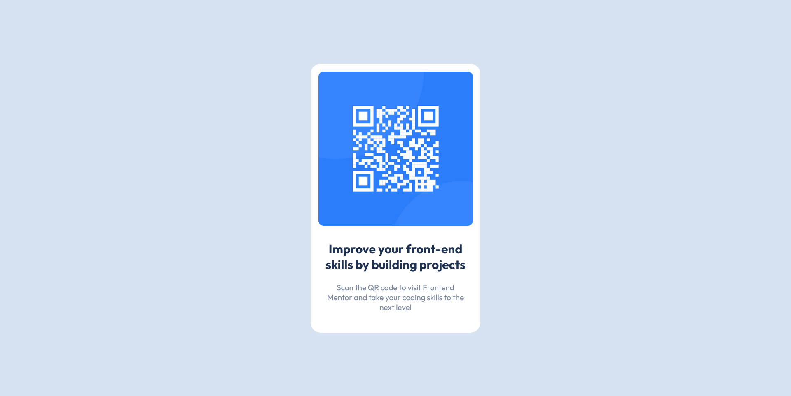

# Frontend Mentor - QR code component solution

This is a solution to the [QR code component challenge on Frontend Mentor](https://www.frontendmentor.io/challenges/qr-code-component-iux_sIO_H). Frontend Mentor challenges help you improve your coding skills by building realistic projects.

## Table of contents

- [Overview](#overview)
  - [Screenshot](#screenshot)
  - [Links](#links)
- [My process](#my-process)
  - [Built with](#built-with)
  - [Continued development](#continued-development)
  - [Useful resources](#useful-resources)
- [Author](#author)

## Overview

### Screenshot

### Links

- Solution URL: (https://github.com/vishy351/qr-code-component)
- Live Site URL: (https://vishy351.github.io/qr-code-component/)

## My process

### Built with

- HTML5
- CSS
- Flexbox

### Continued development

I would like to focus on how to work with flexbox and setting up background images with desired settings

### Useful resources

- How can I vertically center a div element for all browsers using CSS? (https://stackoverflow.com/a/36298070)
- The align-items Property (https://www.w3schools.com/css/css3_flexbox_container.asp)

## Author

- Frontend Mentor - [@vishy351](https://www.frontendmentor.io/profile/vishy351)
- Github - (https://github.com/vishy351)
